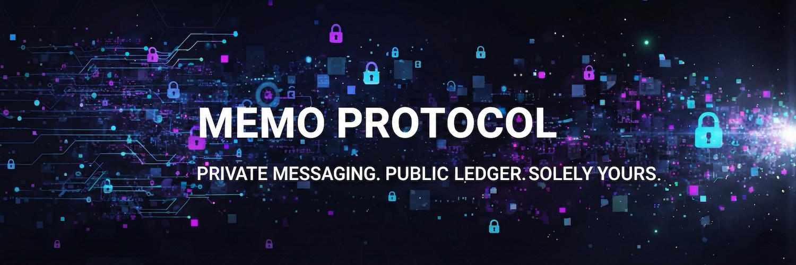

# Memo Protocol



### The Immutable Communication Layer for Solana

[]() []()

**Memo Protocol** is the first decentralized messaging infrastructure designed to bridge the gap between casual social coordination and rigid enterprise compliance. By leveraging the Solana blockchain, we provide a communication layer where messages are not just text—they are immutable, verifiable on-chain records.

> *"When your message can't afford to disappear, it lives on-chain."*

---

## The Ecosystem

Memo Protocol operates on a single, secure ledger but powers two distinct ecosystems tailored to specific user needs: **Memo Social** for community velocity and **Memo Enterprise** for business stability.

### 1. Memo Social
**The Community Engine.**
Memo Social turns passive token holders into active, coordinated communities. It provides the tools necessary for projects to manage engagement, filter noise, and protect their members.

#### Key Features
*   **Token-Gated Communities**:
    *   **Proof-of-Ownership**: Automatically restrict access to verified token holders.
    *   **Whale Channels**: Create exclusive sub-channels for top % holders (e.g., "Top 1% Only").
    *   **Sybil Resistance**: Native protection against bot spam by requiring on-chain assets.
*   **AI Community Agent**:
    *   **Farmer Detection**: Intelligent analysis to identify and flag "farming" behavior vs. genuine engagement.
    *   **Whale Alerts**: Real-time notifications when significant capital enters or exits the ecosystem.
    *   **Sentiment & Activity Analysis**: Automated insights into community health and trending topics.
*   **Encrypted DMs**: End-to-end encrypted direct messaging between any two Solana wallets.

### 2. Memo Enterprise
**The Business Standard.**
Memo Enterprise is built for high-stakes environments where the integrity of communication is paramount. It serves as a legal-grade record for agreements, negotiations, and regulatory compliance.

#### Key Features
*   **On-Chain Contract Signing**:
    *   **Immutable Signatures**: Execute agreements with cryptographic certainty. Signatures are timestamped and permanently recorded on the Solana ledger.
    *   **Audit Trails**: A complete, unalterable history of negotiations and approvals, ready for legal discovery.
*   **Regulatory Compliance**:
    *   **Verifiable Identity**: Link wallet addresses to verified corporate identities.
    *   **Permanent Record**: Messages cannot be deleted or altered, satisfying strict data retention requirements (e.g., for financial services).
*   **Secure Infrastructure**:
    *   **Zero-Knowledge Architecture**: We cannot read your messages. Only the holder of the private key can decrypt the content.

---

## Core Technology

Memo Protocol is built on a foundation of cryptographic security and decentralized infrastructure.

### Smart Transfer Protocol
We utilize a unique **Smart Transfer** mechanism to ensure reliable delivery while optimizing costs:
-   **New Connections**: Automatically detects empty wallets and attaches a **Rent Exemption** transfer (~0.001 SOL) to initialize the recipient's account on-chain.
-   **Existing Connections**: Sends messages with **0 SOL** transfer value, incurring only the standard network fee (~0.000005 SOL).

### Zero-Knowledge Encryption
All messages are encrypted **client-side** using **TweetNaCl (Curve25519)** before they ever touch the network.
-   **Asymmetric Encryption**: Messages are encrypted with the recipient's public key.
-   **Forward Secrecy**: Each session generates unique nonces.
-   **No Backdoors**: The protocol has no "admin keys" or central servers that store plaintext.

### Immutable Storage
Messages are stored directly in the transaction history via the **Solana Memo Program**, providing permanent, public proof of existence while keeping content private.

---

## Architecture

```
┌─────────────┐       ┌─────────────┐
│ User Client │──────►│  TweetNaCl  │
└─────────────┘       └─────────────┘
       │                     │
       ▼                     ▼
┌───────────────────────────────────┐
│       Smart Transfer Logic        │
└───────────────────────────────────┘
       │                     │
       │ (New Wallet)        │ (Existing)
       ▼                     ▼
┌────────────────┐    ┌─────────────┐
│ Attach Rent    │    │ Attach 0    │
│ (~0.001 SOL)   │    │ SOL         │
└────────────────┘    └─────────────┘
       │                     │
       ▼                     ▼
┌───────────────────────────────────┐
│          Solana Network           │
└───────────────────────────────────┘
                 │
                 ▼
        ┌─────────────────┐
        │  Memo Program   │
        └─────────────────┘
                 │
                 ▼
        ┌─────────────────┐
        │ On-Chain Ledger │
        └─────────────────┘
                 │
                 ▼
        ┌─────────────────┐
        │ Recipient Inbox │
        └─────────────────┘
```

---

## Roadmap

### Phase 1: Foundation (Current)
- [x] Core Messaging Protocol
- [x] End-to-End Encryption
- [x] Basic Community Features

### Phase 2: Expansion
- [ ] **Enterprise**: Advanced Contract Templates & PDF Generation
- [ ] **Social**: Multi-Chain Support & NFT Gating
- [ ] **Infrastructure**: Mobile App Launch (iOS/Android)

### Phase 3: Ecosystem
- [ ] Developer SDK & API
- [ ] Third-Party Integrations (Slack, Discord bridges)
- [ ] Decentralized Governance

---

**Built by the Memo Protocol Team**

*Making verifiable private communication on public blockchains a reality.*